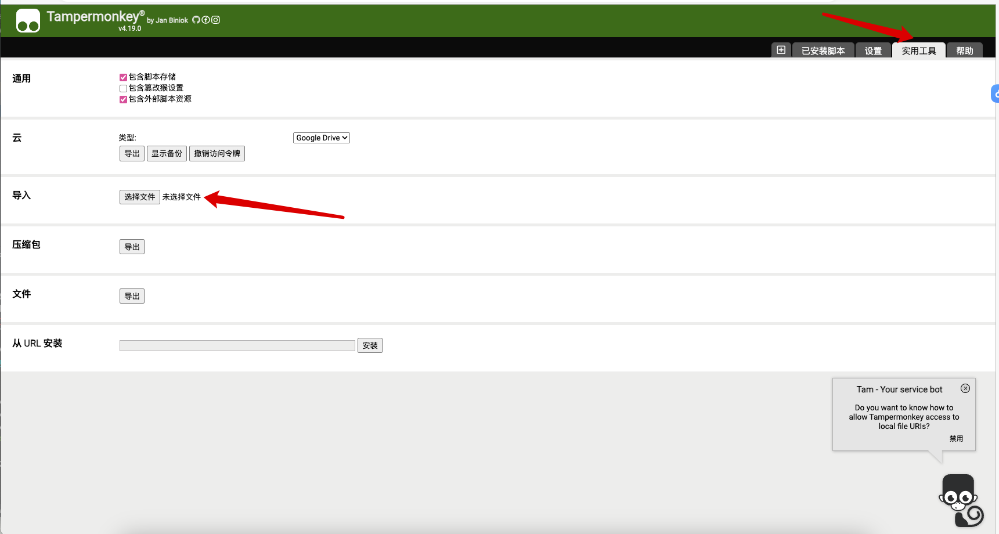
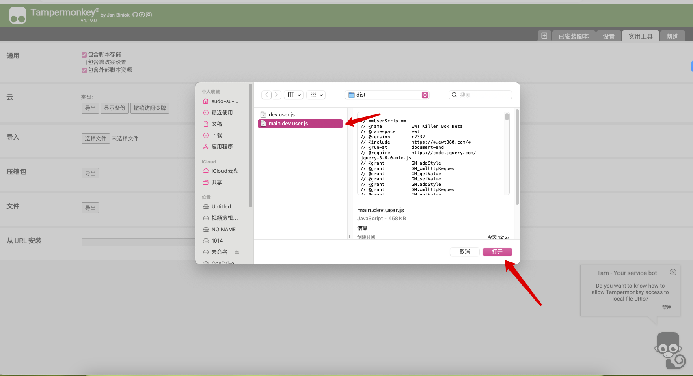
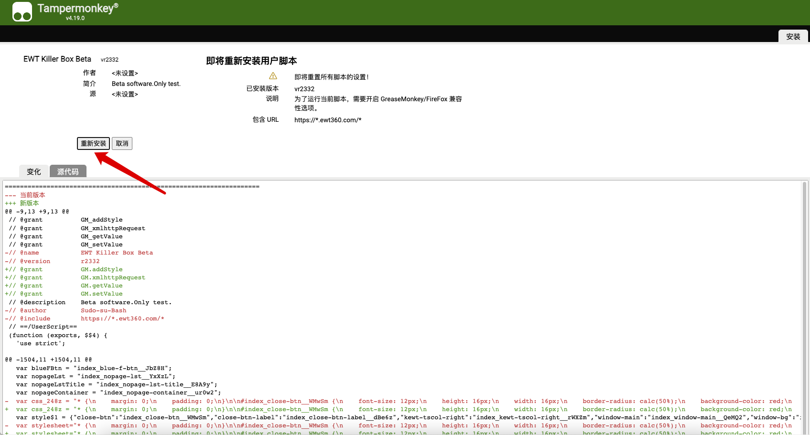
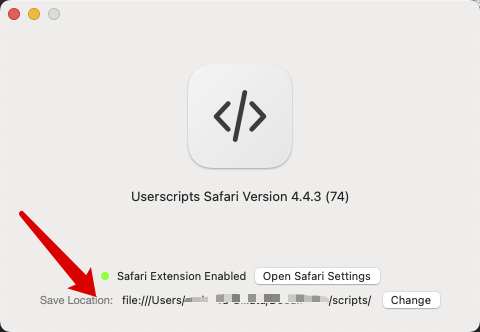
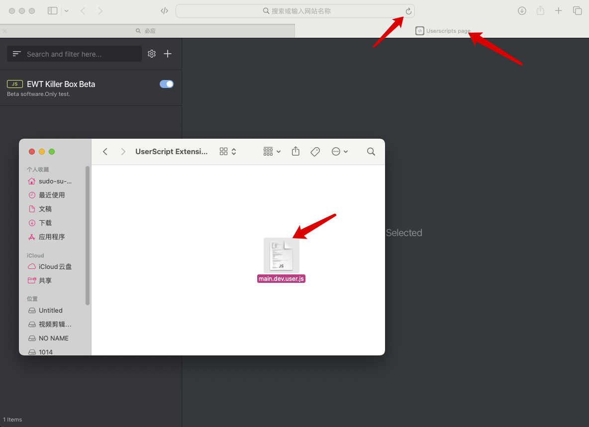

# Dev分支说明
此分支用于存放半成品程序部分源代码,包括实验性功能.
# 介绍

本产品为一款针对 EWT 的研究程序.

# 编译及运行

由于某些原因，现已将核心部分闭源，所以请不要通过npm指令编译.<br>
敬请谅解.<br>
如果有喜好研究的人想将此程序补充完整,可以自行探究接口,并根据views等源代码的函数调用来补齐jumpclasses,missions,pojo,finishhomeworks文件夹中的代码.

[//]: # (可以通过以下命令进行编译:<br>)

[//]: # (Linux/macOS &#40;本人开发环境为 macOS&#41;)

[//]: # ()
[//]: # (```shell)

[//]: # (cd EWT-Killer-Box)

[//]: # (sudo npm install)

[//]: # (sudo npm run build)

[//]: # (```)

[//]: # ()
[//]: # (Windows:)

[//]: # ()
[//]: # (```shell)

[//]: # (cd EWT-Killer-Box)

[//]: # (npm install)

[//]: # (npm run build)

[//]: # (```)

[//]: # ()
[//]: # (编译后的脚本在源代码根目录中. 可以直接将其添加到油猴脚本中.)

# 兼容性

<span style="color: green">Y</span>=完全支持&nbsp;&nbsp;<span style="color: yellow">P</span>=部分功能支持/有可能会抽风&nbsp;&nbsp;<span style="color: red">N</span>=不支持&nbsp;&nbsp;<span style="color: gray">U</span>=未知<br><br>
已知插件平台:<br>
<span style="color: green">Y</span>&nbsp;&nbsp;&nbsp;&nbsp;&nbsp;TamperMonkey<br>
<span style="color: green">Y</span>&nbsp;&nbsp;&nbsp;&nbsp;&nbsp;GreaseMonkey<br>
<span style="color: yellow">P</span>&nbsp;&nbsp;&nbsp;&nbsp;&nbsp;UserScripts<br>
<span style="color: red">N</span>&nbsp;&nbsp;&nbsp;&nbsp;&nbsp;Stay<br>
<span style="color: gray">U</span>&nbsp;&nbsp;&nbsp;&nbsp;&nbsp;其他电脑/手机上自称自带插件功能(不等于扩展)的浏览器的插件平台<br>

已知浏览器:<br>
<span style="color: green">Y</span>&nbsp;&nbsp;&nbsp;&nbsp;&nbsp;PC/Mac/Linux Chrome<br>
<span style="color: green">Y</span>&nbsp;&nbsp;&nbsp;&nbsp;&nbsp;PC/Mac/Linux/Android Firefox<br>
<span style="color: green">Y</span>&nbsp;&nbsp;&nbsp;&nbsp;&nbsp;Android Kiwi Browser<br>
<span style="color: yellow">P</span>&nbsp;&nbsp;&nbsp;&nbsp;&nbsp;iPhone&Mac Safari<br>
<span style="color: red">N</span>&nbsp;&nbsp;&nbsp;&nbsp;&nbsp;Internet Explorer<br>
<span style="color: red">N</span>&nbsp;&nbsp;&nbsp;&nbsp;&nbsp;iPhone Firefox/Chrome<br>
<span style="color: red">N</span>&nbsp;&nbsp;&nbsp;&nbsp;&nbsp;Android Chrome(原生)<br>
<span style="color: gray">U</span>&nbsp;&nbsp;&nbsp;&nbsp;&nbsp;其他浏览器<br>

# 使用方式

1.下载/自己编译脚本.<br> 2.如果你是油猴使用者,请你点击油猴管理面板->实用工具->导入,然后选择脚本安装.如图.<br>


(这个脚本仅做演示,在你实际导入的时候,选择你下载好/编译好的脚本)

或者,你可以直接把文件拖到油猴的"已安装脚本"页面,也可以获得相同的效果.<br>
注意:切记不要通过 ctrl+c/v 来复制代码,否则 Tampermonkey 面板会卡死!!!<br>
如果你是 Userscripts/macOS&iOS 使用者,请打开 Userscripts 应用,然后找到下面的 Save Location,右边就是脚本存放地址.<br>
<br>
用访达/iPhone 文件管理找到该位置后,<span style="color: red">直接将新脚本复制/替换进去即可.</span>,然后<span style="color: red">刷新 Userscripts 页面.</span><br>
 3.此时打开 EWT 网址,应该能看到左边有一竖功能栏,出现这个就意味着安装成功.

# 免责声明
本程序遵循GPL2开源协议，且不得用于商业用途。
如果因为您擅自违反协议/违反国家法律法规所造成的一切后果，作者不用承担任何责任。